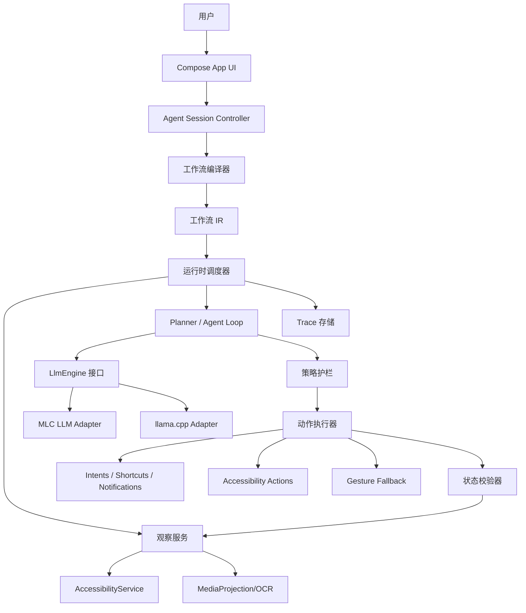
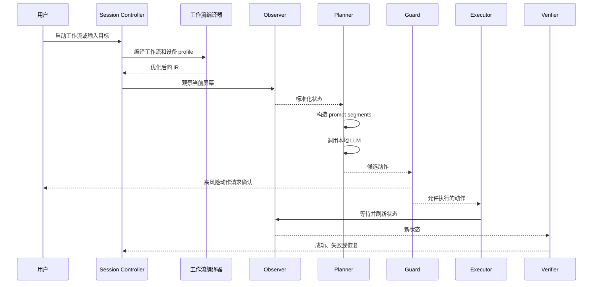

# DroidLoom 系统架构

## 1. 架构原则

- 用户授权优先：每个敏感能力都必须有可见开关、用途说明和撤销路径。
- API 优先、屏幕兜底：能用 Intent、Shortcut、通知 action 或公开 API 完成的事情，不用坐标点击。
- 结构化观察优先：accessibility tree 是主输入，截图/OCR 是补充输入。
- 工作流可编译：用户工作流必须进入 IR，经过静态检查、降级、优化和 guard 插入。
- 本地优先：默认本地推理和本地日志；远端模型必须显式开启。
- 动作可验证：每个动作后都有状态观测和 verifier，不让模型输出直接驱动下一步。

## 2. 组件图



## 3. 运行时流程



## 4. 模块边界

### `app`

- Compose UI。
- onboarding、权限 disclosure、session 控制、工作流列表、trace viewer。
- 不直接持有 AccessibilityService 或 MediaProjection 低层细节。

### `service-accessibility`

- Android `AccessibilityService` 实现。
- 读取 window tree、提取 node snapshot。
- 执行 node action、global action、gesture fallback。
- 提供最小 IPC 接口给 runtime，不暴露原始服务实例。

### `service-capture`

- MediaProjection session lifecycle。
- 局部截图、降采样、OCR pipeline。
- 只在 session 需要时启动 foreground service。

### `runtime-workflow`

- 工作流 DSL / JSON schema。
- IR data model。
- compiler pass manager。
- dominance、liveness、KV lifetime、risk annotation。

### `runtime-agent`

- planner loop。
- prompt segment builder。
- tool registry。
- action schema parser。
- verifier orchestration。

### `runtime-llm`

- `LlmEngine` 接口。
- MLC LLM adapter。
- llama.cpp adapter。
- model profile registry。

### `storage`

- Room：工作流、trace、model profile、compiled plan metadata。
- DataStore：settings、privacy flags、permission state cache。
- 加密：敏感 trace、截图引用、prompt snapshots。

### `benchmark`

- UI Automator tests。
- AndroidWorld-style task harness。
- latency/memory/battery benchmark scripts。

## 5. 核心数据模型

```kotlin
data class ScreenState(
    val packageName: String,
    val activityName: String?,
    val windows: List<WindowSnapshot>,
    val ocrBlocks: List<OcrBlock>,
    val timestampMs: Long
)

data class WorkflowNode(
    val id: NodeId,
    val op: WorkflowOp,
    val inputs: List<NodeId>,
    val attributes: Map<String, Value>
)

data class PromptSegment(
    val role: SegmentRole,
    val text: String,
    val cacheScope: CacheScope,
    val invalidationKey: String
)

data class ActionPlan(
    val action: Action,
    val risk: RiskLevel,
    val preconditions: List<StatePredicate>,
    val verifier: StatePredicate
)
```

## 6. 编译流程

```text
解析工作流
  -> 校验 schema 和权限
  -> 构建控制流/数据流图
  -> 将能力降级到可用 Android 工具
  -> 裁剪 observation
  -> 折叠 prompt 常量
  -> 标注风险
  -> 分析 prompt/KV 生命周期
  -> 规划 retry 和 verifier 节点
  -> 生成可执行计划
```

## 7. 安全设计

- 所有高风险 action 必须声明 risk level。
- 工作流安装时做静态权限摘要：会读什么、会做什么、何时需要确认。
- session 运行时显示 foreground notification。
- 默认不保存截图；保存 trace 时只保留脱敏文本和 action 元数据。
- 每个外部 App/package 可设置 allowlist/denylist。
- 任何跨 App 发送、支付、删除、授权、公开发布动作都必须人工确认。
- 运行时必须支持 `TakeOver`、`Confirm`、`StopSession` 和 `TraceReplay` 四类基础控制动作。
- 产品能力按 L0-L5 分级开放：只读观察、建议模式、确定性工作流、受限 Agent、高风险确认、人工接管。
- 每个工作流必须绑定 `CapabilityManifest` 和 `SupportedAppMatrix`，不能宣称对所有 App 通用可靠。

## 8. 首个可运行原型范围

MVP 只做一个窄闭环：

1. 用户启动 session。
2. AccessibilityService 读取当前 screen tree。
3. 工作流编译器生成一个简单 plan。
4. 本地 LLM 选择下一步 action。
5. Guard 检查风险。
6. Accessibility action 或 gesture 执行。
7. Verifier 读取新 screen tree 判断成功。

MediaProjection、OCR、复杂 KV cache、远端模型、工作流 marketplace 都不进入第一版闭环。
